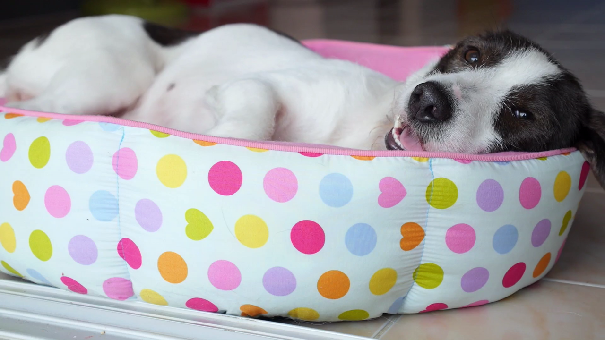
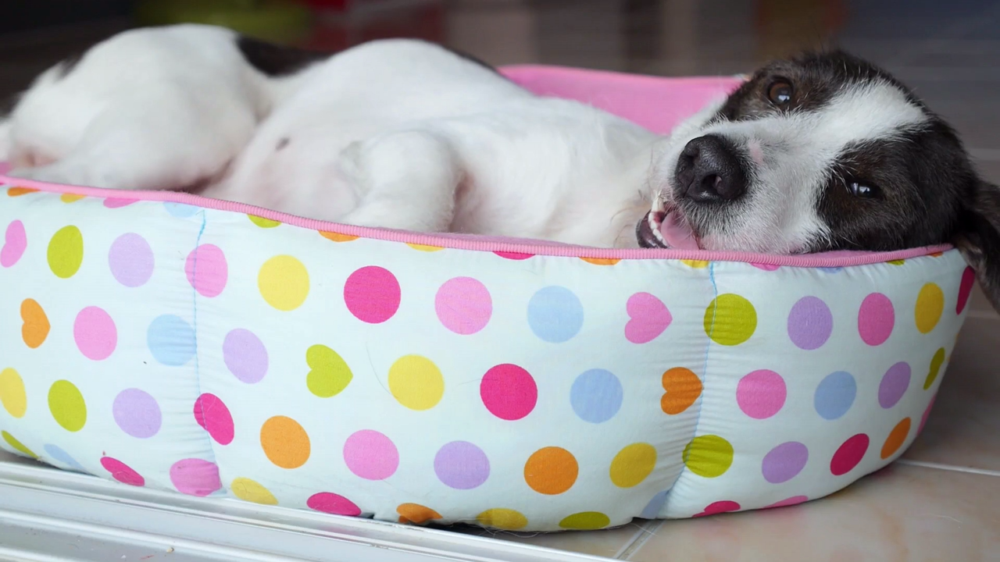

# Z-Tensor

[](https://www.python.org/)
[](https://pytorch.org/)
[](LICENSE)


### My Custom-Made Hardware-Accelerated Video Codec built from scratch in PyTorch. No FFmpeg. No libav. No shortcuts.

Z-Tensor encodes raw videos using **motion estimation**, **scene-aware I-frame selection**, **chroma subsampling**, and **Zstandard compression**. Every step runs as a native tensor operation, and the whole pipeline can run on CPU or GPU. Lossless and lossy modes are both supported.

The name comes from its two main components: **Z** from Zstandard, which is used as the compressor, while **Tensor** comes from PyTorch Tensors because every pixel-level operation runs as a tensor op, keeping the heavy lifting on the GPU and out of Python loops.

---

## Why build a codec from scratch?

Because I like building efficient systems and optimizing my own code to run faster. I also genuinely like working with images, video and compression. Building a video codec is a project where all of these topics intersect, and I wanted to see if I could do it.

---

## Okay, but why PyTorch?

PyTorch turned out to be a surprisingly good library for this project. Tensor ops can run on the GPU, which makes writing GPU-accelerated code pretty easy as long as you can do everything in tensors. Also, some of the features I implemented like chroma subsampling, block matching and keyframe detection benefit a lot from PyTorch's functions. For example: `F.conv2d` can be used as a convolution operator for running batched edge detection, `nn.Unfold` can be used to generate frame-wise sliding windows of variable sizes for block matching, and `AvgPool2d` can be used for chroma subsampling, since chroma subsampling is literally just an average pooling! 

This showed me an alternative side of PyTorch that very few people consider when they're using it. Also, if I ever want to use AI for Neural Compression for example, Torch is already installed and I can easily integrate these AI models with the existing code.

---

## Showcase

These frames come from a video that Z-Tensor encoded at 7.4x compression using Balanced mode.

**PSNR:** 43.26 dB &nbsp;|&nbsp; **SSIM:** 0.99 &nbsp;|&nbsp; **Compression:** 7.4× &nbsp;|&nbsp; **File sizes:** 316.4 MB (Original) to 42.9 MB (Z-Tensor)

**Original frame**



**Z-Tensor encoded and decoded** (Balanced mode)



---

## Results

Tested on standard CIF/QCIF benchmark videos:

### Balanced Mode (`--chroma quarter -qp 0`)

| Video | PSNR (dB) | SSIM | Original | Z-Tensor | Compression |
|---|---|---|---|---|---|
| bowing_cif.avi | 44.82 | 1.00 | 87.0 MB | 16.2 MB | **5.4×** |
| bus_cif.avi | 40.89 | 1.00 | 43.5 MB | 12.5 MB | **3.5×** |
| carphone_qcif.avi | 40.62 | 0.99 | 27.7 MB | 6.9 MB | **4.0×** |

### Lossless (`--chroma full -qp 0`)

| Video | PSNR (dB) | SSIM | Original | Z-Tensor | Compression |
|---|---|---|---|---|---|
| bowing_cif.avi | Lossless | 1.00 | 87.0 MB | 39.8 MB | **2.2×** |
| bus_cif.avi | Lossless | 1.00 | 43.5 MB | 29.8 MB | **1.5×** |
| carphone_qcif.avi | Lossless | 1.00 | 27.7 MB | 16.0 MB | **1.7×** |

**Quality reference:** PSNR ≥ 40 dB / SSIM ≥ 0.95 is considered visually indistinguishable from the original.

---

## How the encode pipeline works

```
Raw video (BGR)
      │
      ▼
  Scene change detection:
      │
      ├──► Convert video to grayscale
      │
      ├──► Compute a histogram for every frame.
      │
      ├──► Frames where the histogram changes abruptly are marked as scene cuts.
      │
      ├──► The first and last frames of each scene are stored as the bounds of that scene.
      │
      ├──► Sobel is applied over all frames in each scene.
      │
      ├──► Each scene gets the sharpest frame near its cut as an I-frame.
      │
      ├──► Long scenes get periodic I-frames so P-frame chains don't run for too long.
      │
      ├──► I-frames are used as references for frame reconstruction.
      ▼
  Apply Chroma subsampling: 4:4:4 / 4:2:2 / 4:2:0 (Optional)
      │
      ▼
  Block matching
      │
      ▼
  Residual quantization to force similar residuals into bins to improve compression (Optional)
      │
      ▼
  Serialize video to bytes
      │
      ▼
  Compress serialized video with Zstandard
      │
      ▼
  .ztensor file
```

The decoder runs this in reverse: Zstandard decompresses the .ztensor file → serialized video is parsed to get the header info and the video content → reconstruct frames by undoing block matching → chroma upsampling in case the encoder used chroma subsampling → save video as playable .avi file.

---

## The interesting parts

### Block Matching Motion Estimation

Most pixels in a video tend to not change much between frames. For example: a car driving past, a dog running. In all of these, large regions of the frame are either static or moving predictably, and storing every frame independently ignores this completely, wasting a lot of disk space on information the previous frame already contained.

The most natural approach to address this is called "frame differencing". Frame differencing subtracts the previous frame from the current one and stores only the differences, which are called "residuals". This is where most compression gains come from. If most residuals are filled with zeros, the compressor notices all these repeated zeros in the residuals and compresses them, shrinking the file size. Frame differencing generally works well for static scenes, but it completely ignores motion. If a car driving fast moves 20 pixels to the right, frame differencing sees the entire car-shaped region as "changed" and stores all of it, even though nothing about the car itself actually changed.

Block matching is much smarter. It divides the frame into blocks, and for each block, the encoder searches in the previous frame for the most similar block within a search area. The most similar block will hopefully yield lots of zeros for the compressor, which noticeably improves compression. In my tests, block matching compressed 10-20% better than frame differencing.

Instead of storing residuals for the entire frame, block matching stores the residuals for each block and a motion vector that tells the decoder where to look in the previous frame to reconstruct the current block. This way, a car that moved 20 pixels to the right gets a motion vector of (20, 0) and residuals that are nearly all zeros, which compresses better.

Example: 
```
Frame N-1 (previous frame)   Frame N (current)
┌─────────────────────┐     ┌─────────────────────┐
│                     │     │                     │
│    ┌───┐            │     │         ┌───┐       │
│    │ A │            │     │         │ A'│       │
│    └───┘            │     │         └───┘       │
│                     │     │                     │
└─────────────────────┘     └─────────────────────┘
         ↑                           ↑
   Best matching block          Current block
   found in previous frame      being encoded
         └──────── motion vector ────┘
```

While searching for similar blocks in the previous frame is technically simple from a programming standpoint, the challenge is doing this efficiently without slow Python loops.

Z-Tensor implements this by using `nn.Unfold` to extract all candidate patches from the previous frame in one shot, then computes the scores of all blocks in a single vectorized tensor operation:

```python
# Extract all candidate patches from the previous frame
blocks_plane0 = unfold_stride_1(plane0.unsqueeze(0).unsqueeze(0))

# Extract the non-overlapping blocks from the current frame
blocks_plane1 = unfold_window(plane1.unsqueeze(0).unsqueeze(0))

# Vectorized scoring: shape (num_blocks_plane1, num_candidates), computed in one tensor op
scores = (blocks_plane1[:, None, :] - blocks_plane0[candidate_ids]).abs().sum(dim=-1)
```


---

### Scene-Aware I-frame Selection

A frame that is represented by residuals is called a "P-frame". While P-frames are easy to compress because they tend to be filled with zeros, they can also be tricky to deal with, since they entirely depend on the previous frame to be reconstructed. This can cause problems in lossy compression, since lossy compression means that the residuals are not exactly frame-perfect, and that the reconstructed picture is slightly different from the original. Because lossy compression discards information, the more consecutive P-frames are used to reconstruct the image, the more this error between the reconstructed video and the original video accumulates, resulting in a noticeable degradation in quality after enough frames have passed. This is one of the reasons why codecs periodically insert independent frames that are copied straight from the source video (called I-frames) to "reset" this error accumulation.


The simplest approach is to insert an I-frame every N frames on a fixed schedule. However, this can waste bytes. If an I-frame lands in the middle of a static scene, it will mostly encode redundant information the previous frame already had, wasting bytes. Or even worse: if the fixed schedule places an I-frame just before an abrupt cut, this means the scene right after the cut will have to be reconstructed by using a completely different scene as reference, producing large residuals that, when quantized, can lead to noticeable quality degradation.

Z-Tensor solves this by detecting scene boundaries and placing I-frames intelligently, in two stages.

**Step 1: Find scene cuts via histogram deltas.** First, Z-Tensor computes a histogram of each frame. Whenever there is an abrupt scene change (like a cut, a flash or a major lighting shift), the histogram also changes abruptly. Z-Tensor uses this information to create temporal boundaries that pinpoint where these major shifts happen, separating the video into a list of "scenes".


**Step 2: Anchor I-frames near each scene's start and in the middle of long P-frame chains.** Once the scene boundaries are known, Z-Tensor runs Sobel edge detection (using `F.conv2d` on the GPU as a convolution operator) over every frame and measures its edge variance. A sharp, detailed frame has lots of strong edges, so it ends up with high edge variance, while a blurry or transitional frame has weak edges and low variance. This makes edge variance a good proxy for how sharp a frame is. Then, for each scene, it sets the frame with the highest edge variance near the scene's start as that scene's starting I-frame.

The reason it only looks at a window right after the cut is to skip transitional frames. Flashes, fades and motion-blurred transitions tend to have low edge variance, so picking the sharpest frame in the window naturally skips past them and lands on the first clean frame instead. Sharp frames are also better references, since blurry frames are usually unintentional (poor focus, fast movement) and offer the least detail for reconstruction, while sharp frames yield better residuals and give better points to reset error accumulation. 

Additionally, long scenes receive extra I-frames at a capped interval so that chains of consecutive P-frames don't grow long enough for lossy error to build up noticeably. Each of those resets is also chosen as the sharpest frame in its window.

This way Z-Tensor picks sharp I-frames near each cut rather than just inserting one every N frames.


```
Histogram delta over time:

                               │  ← scene cut detected here
                               ▼       
                               ┌────────          
                               │
                               │
  ─────────────────────────────┘   
  [     Scene 1                ][   Scene 2   ]
   ▲                   ▲         ▲
   │                   │         │
I-frame here           │      I-frame here
(sharpest frame        │      (sharpest frame
near scene cut)        │      near scene cut)
                       │
                       │
                    I-frame here
                    (sharpest frame that breaks
                    a long P-frame chain)
```

---

### Chroma Subsampling

Human eyes are much more sensitive to changes in brightness than to changes in color. Chroma subsampling is a pretty interesting technique that works in two steps: first it converts an RGB image into a YUV image, where Y is the brightness component and U and V are the two chromatic components that carry color information. Then, it takes advantage of how human eyes work and lowers the resolution of the U and V channels to save on disk space. This is naturally a lossy operation, but in practice it loses so little detail that it is nearly unnoticeable to our eyes.

There are different ways to implement this drop in resolution, with the most common approaches being called 4:2:2 (also called half-width) and 4:2:0 (also called quarter). 4:2:2 halves the resolution on the horizontal axis, while keeping the Y resolution the same. Meanwhile, 4:2:0 halves the resolution of both horizontal and vertical axes, making the resolution of the U and V channels a quarter of the original.

Since chroma subsampling is literally just spatial average pooling on the U and V planes, `AvgPool2d` can do it natively on the GPU:

```python
# BGR to YUV color space conversion
y = torch.sum(bgr * weights, dim=-1)
u = 128 + (0.492 * (b - y))
v = 128 + (0.877 * (r - y))

# 4:2:2: halve U and V on the X axis
pool2d = torch.nn.AvgPool2d(kernel_size=(1, 2), stride=(1, 2))
uv_subsampled = pool2d(uv)

# 4:2:0: halve U and V in both X and Y axis
pool2d = torch.nn.AvgPool2d(kernel_size=2, stride=2)
uv_subsampled = pool2d(uv)
```

The decoder then upsamples the U and V planes before converting to RGB.

---

### Serialization & the Binary Format

The `.ztensor` format is a custom file format: It has a header that stores the configuration used during encoding, followed by the per-plane frame contents containing I-frame pixel data, and the motion vectors and residuals calculated by the block matching motion estimation function. The entire serialized file is then compressed with Zstandard.

```
┌──────────────────────────────────────────────────────┐
│  HEADER                                              │
│  pixel_format   (4 bytes, ASCII: RGB3/I422/I420)     │
│  quantization   (1 byte,  uint8)                     │
│  num_i_frames   (4 bytes, uint32)                    │
│  i_frame_idxs   (num_i_frames × 4 bytes, uint32[])   │
│  block_width    (4 bytes, uint32)                    │
│  num_planes     (4 bytes, uint32)                    │
│  num_frames     (4 bytes, uint32)                    │
├──────────────────────────────────────────────────────┤
│  PLANE 0                                             │
│    I-frames     raw pixel data (uint8)               │
│    P-frames     motion_vectors (int8,  T × L × 2)    │
│                 residuals      (uint8, T × L × B²)   │
├──────────────────────────────────────────────────────┤
│  PLANE 1 ...                                         │
│  PLANE 2 ...                                         │
└──────────────────────────────────────────────────────┘
```

One detail worth explaining: when serializing the video, appending the contents to an empty `bytes` object with `+=` is O(N^2) because Python allocates a brand new buffer and copies everything into it on every append. For a video with hundreds of megabytes of frame data, this gets slow quickly.

The fix is to append each component to a `list` instead, then call `b"".join()` once at the end. Python stores only the memory addresses in the list, so there are no memory copies until the final join. The final join allocates exactly one buffer of the right size and writes everything into it in one pass:

```python
# Slow: reallocates and copies the entire buffer on every +=
payload = bytes()
payload += motion_vectors.numpy().tobytes()  # O(N²) total

# Fast: no copies until the final join
payload = []
payload.append(motion_vectors.numpy().tobytes())
result = b"".join(payload)  # one allocation, one pass
```

It's a small detail in isolation, but exactly the kind of thing that matters when you're serializing hundreds of megabytes of frame data in a tight loop.

---

## Installation

```bash
git clone https://github.com/RafaelAmauri/Z-Tensor.git
cd Z-Tensor
pip install -r requirements.txt
```

---

## Usage

### Encode

```bash
# Lossless: full chroma, no quantization
python main.py -i test_videos/bowing_cif.avi -n bowing_out -e --chroma full -qp 0 -device 0

# High Quality: 4:2:2 chroma, no quantization. Visually indistinguishable from the original.
python main.py -i test_videos/bowing_cif.avi -n bowing_out -e --chroma half-width -qp 0 -device 0

# Balanced: 4:2:0 chroma, no quantization. Excellent fidelity at 4-7x compression
python main.py -i test_videos/bowing_cif.avi -n bowing_out -e --chroma quarter -qp 0 -device 0

# Aggressive: 4:2:0 + linear residual quantization. Smallest file
python main.py -i test_videos/bus_cif.avi -n bus_out -e --chroma quarter -qp 1 -device 0

# Low-VRAM GPU: 1 GB budget
python main.py -i test_videos/bowing_cif.avi -n bowing_out -e -mem 1G -device 0

# CPU mode: 16 threads, 3 GB RAM
python main.py -i test_videos/carphone_qcif.avi -n carphone_out -e -device cpu --threads 16 -mem 3G
```

### Decode

```bash
# The .ztensor header stores all settings — just point it at the file
python main.py -i out.ztensor -n decoded -d
```

### Quality test

```bash
# Default config (Balanced): runs PSNR, SSIM, and file size on all test videos
python main.py --test

# High Quality
python main.py --test --chroma half-width -qp 0

# Aggressive
python main.py --test --chroma quarter -qp 1

# Lossless
python main.py --test --chroma full -qp 0
```

---

## Flags

| Flag | What it does |
|---|---|
| `-i / --input-video` | Path to the input video |
| `-n / --name` | Output name (no extension) |
| `-e / --encode` | Encode mode |
| `-d / --decode` | Decode mode |
| `--test` | Run PSNR/SSIM against the test set |
| `-cf` | Zstandard compression level, 1–20 (default 16) |
| `-t / --threads` | Threads for Zstandard (default 4) |
| `-c / --chroma` | `full`, `half-width`, or `quarter` (default `quarter`) |
| `-qp` | `0` = lossless residuals, `1` = linear quantization |
| `-mem` | Memory budget, e.g. `2G`, `500M` (default `2G`) |
| `-device` | `cpu` or a CUDA index like `0` (default `0`) |

---

## What's next

- **Neural Compression:** Z-Tensor currently stores I-frames as raw pixels, but it is possible to compress I-frames with a neural network and store only their features, which take up much less disk space. Then, at decode time, we take those features and reconstruct the I-frames using the network. From there on, the pipeline works as usual, using the I-frames as reference for frame reconstruction.
- **Discrete Cosine Transforms:** A DCT transforms the residuals into the frequency domain before quantization, the way JPEG and real-world video codecs do. This would let the quantizer be smarter about which frequency components to discard.
- **Adaptive Quantization:** instead of applying a fixed quantization step uniformly, Adaptive Quantization varies it spatially based on how human eyes work. JPEG and modern codecs also do this, and it would be neat to have this implemented.