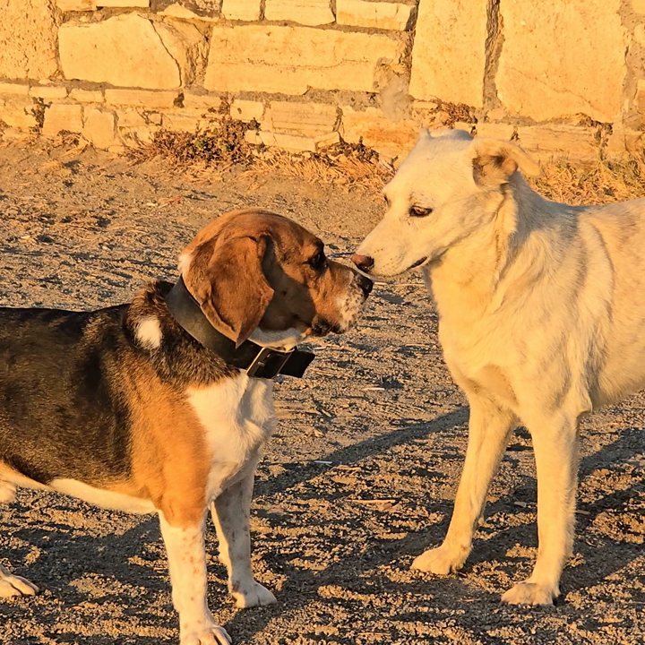

# Z-Tensor

[](https://www.python.org/)
[](https://pytorch.org/)
[](LICENSE)


### My Custom-Made Hardware-Accelerated Video Codec built from scratch in PyTorch. No FFmpeg. No libav. No shortcuts.

Z-Tensor encodes raw videos using **motion estimation**, **scene-aware keyframe selection**, **chroma subsampling**, and **Zstandard entropy coding**. Every step runs as a native GPU tensor operation, and can be run on CPU or GPU. Lossless and lossy modes are both supported.

The name comes from its two main components: **Z** from Zstandard, which is used as the entropy coder, while **Tensor** comes from PyTorch Tensors because every pixel-level operation runs as a tensor op, keeping the heavy lifting on the GPU and out of Python loops.

---

## Why build a codec from scratch?

Because I like building efficient systems and optimizing my own code to run faster. I also genuinely like working with images, video and compression. Building a video codec is a project where all of these topics intersect, and I wanted to see if I could do it.

---

## Okay, but why PyTorch?

PyTorch turned out to be a surprisingly good library for this project. Tensors ops can run on the GPU, which makes writing GPU-accelerated code pretty easy as long as you can do everything in tensors. Also, some of the features I implemented like chroma subsampling, block matching and keyframe detection benefit a lot from functions that come bundled with Torch. For example: `F.conv2d` can be used as a convolution operation for running batched edge detection, `nn.Unfold` can be used to generate frame-wise sliding windows of variable sizes for block matching, and `AvgPool2d` can be used for chroma subsampling, since chroma subsampling is literally just an average pooling! 

This showed me an alternative side of PyTorch that very few people consider when they're using it. Also, if I ever want to use AI for Neural Compression for example, Torch is already installed and I can easily integrate these AI models with the existing code.

---

## Showcase

These frames come from a 4-second clip of two dogs. Z-Tensor encoded it at 3.6x compression with 4:2:0 chroma subsampling.

**PSNR:** 41.13 dB &nbsp;|&nbsp; **SSIM:** 1.00 &nbsp;|&nbsp; **Compression:** 3.6× &nbsp;|&nbsp; **File sizes:** 415 MB (Original) to 116 MB (Z-Tensor)

**Original frame**


**Z-Tensor encoded and decoded** (Balanced mode, 3.6x compression)



---

## Results

Tested on standard CIF/QCIF benchmark videos:

### Balanced Mode (`--chroma quarter -qp 0`)

| Video | PSNR (dB) | SSIM | Original | Z-Tensor | Compression |
|---|---|---|---|---|---|
| bowing_cif.avi | 44.82 | 1.00 | 87.0 MB | 15.9 MB | **5.5×** |
| bus_cif.avi | 40.89 | 1.00 | 43.5 MB | 12.5 MB | **3.5×** |
| carphone_qcif.avi | 40.62 | 0.99 | 27.7 MB | 6.9 MB | **4.0×** |

### Lossless (`--chroma full -qp 0`)

| Video | PSNR (dB) | SSIM | Original | Z-Tensor | Compression |
|---|---|---|---|---|---|
| bowing_cif.avi | Lossless | 1.00 | 87.0 MB | 38.9 MB | **2.2×** |
| bus_cif.avi | Lossless | 1.00 | 43.5 MB | 29.9 MB | **1.5×** |
| carphone_qcif.avi | Lossless | 1.00 | 27.7 MB | 16.0 MB | **1.7×** |

**Quality reference:** PSNR ≥ 40 dB / SSIM ≥ 0.95 is considered visually indistinguishable from the original.

---

## How the encode pipeline works

TODO

---

## The interesting parts

TODO


---

## Installation

```bash
git clone https://github.com/RafaelAmauri/Z-Tensor.git
cd Z-Tensor
pip install -r requirements.txt
```

---

## Usage

### Encode

```bash
# Lossless: full chroma, no quantization
python main.py -i test_videos/bowing_cif.avi -n bowing_out -e --chroma full -qp 0 -device 0

# High Quality: 4:2:2 chroma, no quantization. Visually indistinguishable from the original.
python main.py -i test_videos/bowing_cif.avi -n bowing_out -e --chroma half-width -qp 0 -device 0

# Balanced: 4:2:0 chroma, no quantization. Excellent fidelity at 4-5x compression
python main.py -i test_videos/bowing_cif.avi -n bowing_out -e --chroma quarter -qp 0 -device 0

# Aggressive: 4:2:0 + linear residual quantization. Smallest file
python main.py -i test_videos/bus_cif.avi -n bus_out -e --chroma quarter -qp 1 -device 0

# Low-VRAM GPU: 1 GB budget
python main.py -i test_videos/bowing_cif.avi -n bowing_out -e -mem 1G -device 0

# CPU mode: 16 threads, 3 GB RAM
python main.py -i test_videos/carphone_qcif.avi -n carphone_out -e -device cpu --threads 16 -mem 3G
```

### Decode

```bash
# The .ztensor header stores all settings — just point it at the file
python main.py -i out.ztensor -n decoded -d
```

### Quality test

```bash
# Default config (Balanced): runs PSNR, SSIM, and file size on all test videos
python main.py --test

# High Quality
python main.py --test --chroma half-width -qp 0

# Aggressive
python main.py --test --chroma quarter -qp 1

# Lossless
python main.py --test --chroma full -qp 0
```

---

## Flags

| Flag | What it does |
|---|---|
| `-i / --input-video` | Path to the input video |
| `-n / --name` | Output name (no extension) |
| `-e / --encode` | Encode mode |
| `-d / --decode` | Decode mode |
| `--test` | Run PSNR/SSIM against the test set |
| `-cf` | Zstandard compression level, 1–20 (default 16) |
| `-t / --threads` | Threads for Zstandard (default 4) |
| `-c / --chroma` | `full`, `half-width`, or `quarter` (default `quarter`) |
| `-qp` | `0` = lossless residuals, `1` = linear quantization |
| `-mem` | Memory budget, e.g. `2G`, `500M` (default `2G`) |
| `-device` | `cpu` or a CUDA index like `0` (default `0`) |

---

## What's next

- **Neural Compression:** Traditionally I-frames have to be stored uncompressed to serve as the reference for frame reconstruction. But we can compress them with a neural network and store only their features, which use much less disk space. Then, at decode time, we take those features and reconstruct the I-frames. From there on, the pipeline works as usual, using the I-frames as reference for frame reconstruction.
- **Discrete Cosine Transforms:** transform the residuals into the frequency domain before quantization, the way JPEG and real-world video codecs do. This would let the quantizer be smarter about which frequency components to discard (high-frequency details that compress well) versus preserve (low-frequency structure that matters perceptually).
- **Adaptive Quantization:** instead of applying a fixed quantization step uniformly, Adaptive Quantization varies it spatially based on local content complexity. Flat regions tolerate heavier quantization; high-detail regions need more precision.